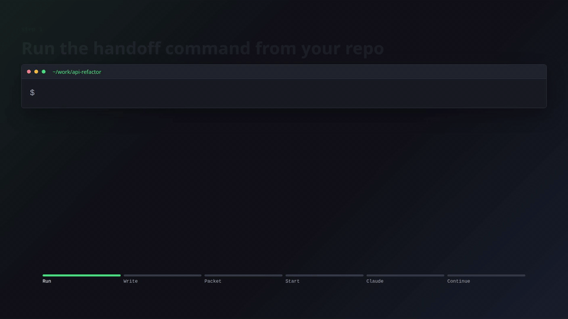

# Handoff

Hit a coding-agent limit mid-refactor?

Handoff lets you hand off local Codex, Claude Code, or Cursor Agent CLI context to another CLI agent.

```sh
handoff codex claude
```

It reads recent local session context when available, writes a markdown handoff file, and starts the next agent. Pass `--repo` when you also want Git branch, commit, working tree, changed files, and snapshot details included.

No server. No dashboard. No hidden state mutation. Just a local handoff file your next agent can read.

Git is optional for the default handoff flow. If the current directory is not inside a Git repository, Handoff writes relative to the current directory. The `--repo` flag requires a Git repository.

## Demo



```sh
# You were working in Codex and want to move to Claude Code
handoff codex claude

# Handoff writes:
# .agent-handoff/latest.md
#
# Then Handoff starts Claude with the generated prompt.
```

Reverse direction:

```sh
handoff claude codex

# Handoff starts Codex with the generated prompt.
```

You can also target any agent command on your `PATH`:

```sh
handoff codex gemini
handoff claude aider
handoff agent codex

# Handoff starts the target command with the generated prompt.
```

If you only want to prepare a handoff and choose the next agent yourself:

```sh
handoff claude
handoff agent

# Handoff writes .agent-handoff/latest.md and prints a generic prompt for your agent.
```

## Install

For local development:

```sh
cargo build
cargo run -- --help
```

After installing the binary on your `PATH`:

```sh
handoff --help
```

From source:

```sh
cargo install --path .
```

Homebrew tap:

```sh
brew tap TStansel/handoff
brew install handoff
```

The Homebrew formula installs prebuilt release binaries from GitHub. It does not build from source and does not install Rust through Homebrew.

The formula template lives at `packaging/homebrew/handoff.rb`. After tagging a release, copy it into the separate `homebrew-handoff` tap repository under `Formula/handoff.rb` and update the binary URLs and SHA-256 values for each published target.

The release workflow publishes binaries for:

```text
aarch64-apple-darwin
x86_64-apple-darwin
x86_64-unknown-linux-gnu
```

`v0.1.2` is the first release with Intel macOS support.

## Commands

```sh
handoff pull codex
handoff pull claude
handoff pull agent
handoff codex
handoff claude
handoff agent
handoff codex claude
handoff claude codex
handoff agent codex
handoff codex <target-agent>
handoff claude <target-agent>
handoff agent <target-agent>
handoff inject claude
handoff inject codex
handoff inject agent
```

Options:

```sh
--dry-run
--session <id|path>
--repo
--include-raw
--include-diff
--inject
--history
--output <path>
--verbose
```

By default, Handoff writes only the markdown output file. It does not update `CLAUDE.md` or `AGENTS.md`, does not create a history archive, and does not write `state.json`.

Add `--inject` if you want Handoff to add a marked pointer block to `CLAUDE.md` or `AGENTS.md`:

```sh
handoff codex claude --inject
```

Add `--history` if you want a timestamped archive copy:

```sh
handoff codex claude --history
```

By default, generated packets omit Git repo details. Add `--repo` to include repo state:

```sh
handoff codex claude --repo
```

Full diffs are also repo state, so `--include-diff` requires `--repo`:

```sh
handoff codex claude --repo --include-diff
```

When a cross-agent handoff completes, Handoff checks Homebrew for an available `handoff` upgrade if `brew` is on your `PATH`. It disables Homebrew auto-update for that check and stays silent unless an upgrade is available. Set `HANDOFF_NO_UPDATE_CHECK=1` to skip the check.

Use `--session` when you want a specific session instead of the latest detected one. It accepts either a file path or a session id:

```sh
handoff codex claude --session 019e2966-f348-7252-9169-8a7ef9f580fe
handoff codex claude --session ~/.codex/sessions/2026/05/14/rollout-2026-05-14T20-11-13-019e2966-f348-7252-9169-8a7ef9f580fe.jsonl
```

Cursor Agent CLI transcripts are detected from local Cursor project storage when present:

```text
~/.cursor/projects/<project-key>/agent-transcripts/<session-id>/<session-id>.jsonl
```

Cursor can key sessions by the opened workspace directory, so Handoff checks the current repo, parent workspace keys, and then falls back to scanning `~/.cursor/projects`.

## Privacy

Handoff is local-first. It reads local agent session files and writes markdown into the current repo. It does not upload transcript data.

Review `.agent-handoff/latest.md` before sharing a repo publicly. If you use `--include-raw`, `.agent-handoff/raw/` may contain sensitive transcript data.

Recommended `.gitignore` entry:

```gitignore
.agent-handoff/raw/
```
